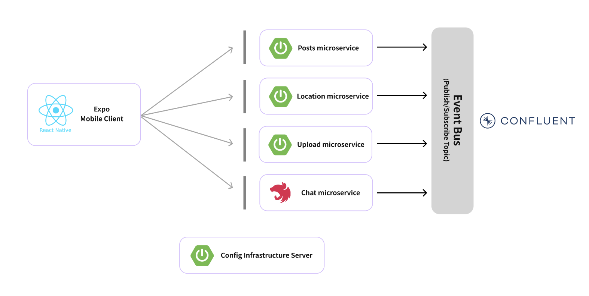

# BlaBla Mobile

BlaBla is location-based social media service. This release intends to share a simplified version of Expo apps and Microservice architecture

# BlaBla Repos

For running this BlaBla mobile application, I built several back-end services with microservice architecture with Azure. You
can find all BlaBla repos in the following locations:

- [Mobile](https://github.com/JaeWangL/blabla-mobile)
- [Service - Posts API](https://github.com/JaeWangL/blabla-api-posts)
- [Service - Location API](https://github.com/JaeWangL/blabla-api-location)
- [Service - Chat API](https://github.com/JaeWangL/blabla-api-chat)
- [Service - Upload API](https://github.com/JaeWangL/blabla-api-upload)
- [Infrastructure - Config](https://github.com/JaeWangL/blabla-infra-config)
- [Infrastructure - Discovery](https://github.com/JaeWangL/blabla-infra-discovery)

**Note:** This document is about the apps using **React Native Expo**.

# Application Diagram

# Application Screens

